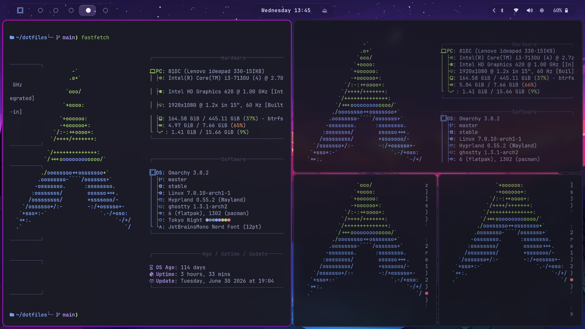
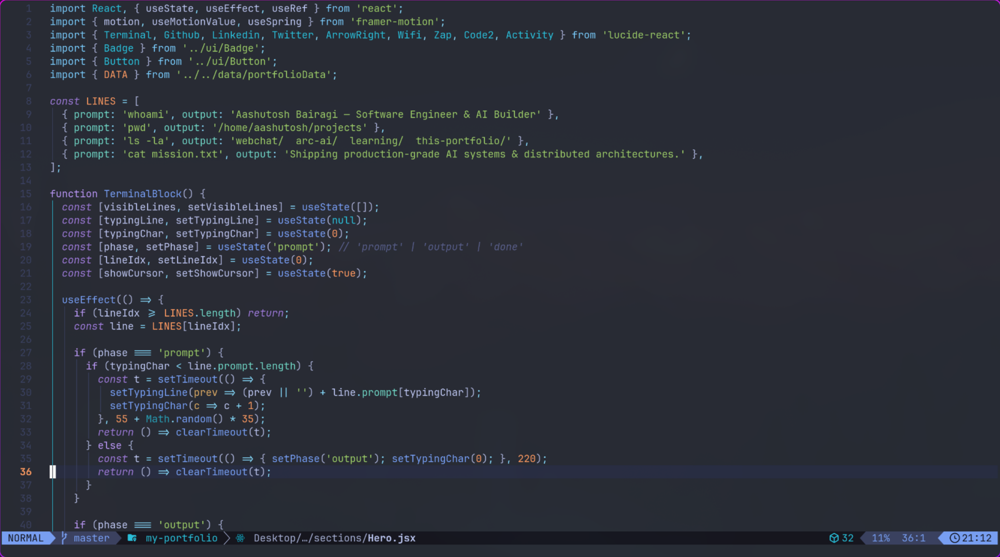
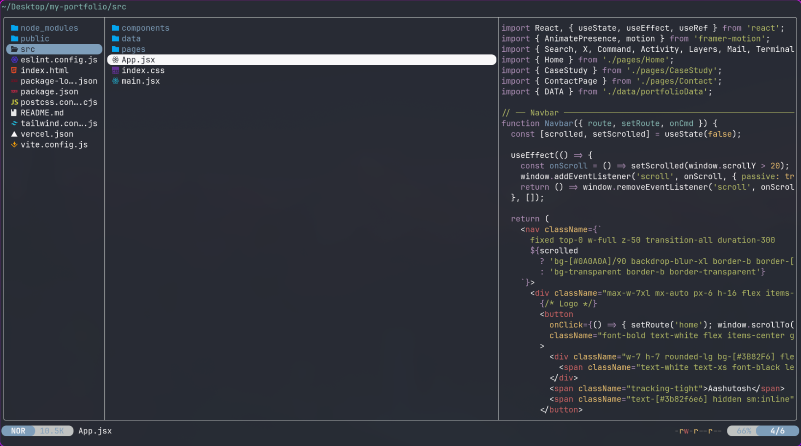

<div align="center">

```
    ___              __          __             __
   /   | ____ ______/ /_  __  __/ /_____  _____/ /_
  / /| |/ __ `/ ___/ __ \/ / / / __/ __ \/ ___/ __ \
 / ___ / /_/ (__  ) / / / /_/ / /_/ /_/ (__  ) / / /
/_/  |_\__,_/____/_/ /_/\__,_/\__/\____/____/_/ /_/
```

**Arch Linux · Omarchy · Hyprland — my daily driver, versioned.**

[](https://archlinux.org)
[](https://hyprland.org)
[](https://github.com/basecamp/omarchy)
[](https://www.zsh.org)
[](LICENSE)

<br>

### ▶️ Live Demo


https://github.com/user-attachments/assets/41fc1ed6-b06a-4639-9338-68ffa2ab9d08


</div>

---

## `$ cat table_of_contents.txt`

- [Screenshots](#-screenshots)
- [Features](#-features)
- [Included Configurations](#-included-configurations)
- [Installation](#-installation)
- [What `install.sh` Actually Does](#-what-installsh-actually-does)
- [What `bootstrap.sh` Actually Does](#-what-bootstrapsh-actually-does)
- [Repository Structure](#-repository-structure)
- [Requirements](#-requirements)
- [Backups & Rollback](#-backups--rollback)
- [Wallpaper Credits](#️-wallpaper-credits)
- [License](#-license)

---

## 📸 Screenshots

<div align="center">

| Desktop | Terminal |
|:---:|:---:|
|  |  |
| *Hyprland + Waybar + Tokyo Night* | *Ghostty + Fastfetch + Starship* |

| Neovim | Yazi |
|:---:|:---:|
|  |  |
| *LazyVim, Tokyo Night* | *File manager in action* |

</div>

> 💡 Add your actual screenshots to a `screenshots/` folder using these filenames (or update the paths above) — `desktop.png`, `terminal.png`, `neovim.png`, `yazi.png`. Even one or two extra shots massively improves first impressions on GitHub.

---

## ✨ Features

| | |
|---|---|
| 🖥️ **WM** | Hyprland on Omarchy |
| 🎨 **Theme** | Tokyo Night, applied system-wide |
| ⚡ **System Info** | Fastfetch |
| ⭐ **Prompt** | Starship |
| 📝 **Editors** | Neovim (LazyVim) & VS Code |
| 📂 **File Manager** | Yazi |
| 🐚 **Shell** | Zsh |
| 👻 **Terminal** | Ghostty |
| 📊 **Monitor** | Btop |
| 🎵 **Audio** | Wiremix |
| 🔊 **OSD** | SwayOSD |
| 🚀 **Bar** | Waybar |
| 🖼️ **Wallpapers** | Curated collection included |

---

## 📦 Included Configurations

```
alacritty · atuin · btop · fastfetch · ghostty · hyprland · kitty
lazydocker · lazygit · mise · mpv · neovim · VS Code · starship · swayosd
tmux · voxtype · walker · waybar · wiremix · yazi · zellij · zsh
```

---

## 📥 Installation

### Option A — One-shot bootstrap (fresh machine)

```bash
curl -fsSL https://raw.githubusercontent.com/Aashutosh31/dotfiles/main/bootstrap.sh | bash
```

Handles everything: installs `git`/`yay` if missing, clones the repo, and runs the installer.

### Option B — Manual (already have the repo cloned, or want to review first)

```bash
git clone https://github.com/Aashutosh31/dotfiles.git
cd dotfiles
chmod +x install.sh
./install.sh
```

---

## 🔍 What `install.sh` Actually Does

<details>
<summary><strong>Click to expand the step-by-step breakdown</strong></summary>

1. **Resolves the repo path** — works regardless of where you run it from (`$REPO` = script's own directory).
2. **Syncs official packages** — runs `pacman -Syu --needed` against [`packages/pacman.txt`](packages/pacman.txt).
3. **Installs AUR packages** — if `yay` is present, installs everything in [`packages/aur.txt`](packages/aur.txt) non-interactively (`--answerclean None --answerdiff None`). Skips gracefully if `yay` isn't found.
4. **Creates a timestamped backup** at `~/.dotfiles-backup/<YYYY><MM><DD>-<HHMMSS>/` — see [Backups & Rollback](#-backups--rollback) below.
5. **Backs up and replaces each config** — for every tool in the list (`alacritty`, `atuin`, `btop`, `fastfetch`, `ghostty`, `hypr`, `kitty`, `lazydocker`, `lazygit`, `mise`, `mpv`, `nvim`, `starship`, `swayosd`, `tmux`, `voxtype`, `walker`, `waybar`, `wiremix`, `yazi`, `zellij`):
   - if a matching config exists in this repo, your current `~/.config/<tool>` is backed up first, then replaced.
6. **Backs up and replaces dotfiles** — `~/.zshrc` and `~/.XCompose` get the same backup-then-overwrite treatment.
7. **Prints the backup location** so you always know exactly where your previous setup went.

**Nothing is deleted without a backup first.** Every overwrite is preceded by a copy (`cp -a`) into the timestamped backup folder.

</details>

---

## 🥾 What `bootstrap.sh` Actually Does

<details>
<summary><strong>Click to expand</strong></summary>

Bootstrap is for a **brand-new machine** that doesn't have this repo (or possibly `git`/`yay`) yet:

1. **Verifies you're on Arch** — checks for `pacman`, exits cleanly otherwise (no Arch, no dice).
2. **Installs Git** if missing.
3. **Installs `yay`** if missing — clones and builds it from the AUR via `makepkg -si`.
4. **Clones or updates the repo** — clones fresh to `~/dotfiles` if it doesn't exist, or `git pull`s if it does.
5. **Makes scripts executable** — `install.sh` and everything in `scripts/`.
6. **Hands off to `install.sh`** to do the actual config installation described above.

In short: `bootstrap.sh` gets a bare Arch install to the point where `install.sh` can run — then runs it.

</details>

---

## 📂 Repository Structure

```text
.
├── alacritty/
├── atuin/
├── btop/
├── fastfetch/
├── ghostty/
├── home/          # ~/.zshrc, ~/.XCompose
├── hypr/
├── kitty/
├── lazydocker/
├── lazygit/
├── mise/
├── mpv/
├── nvim/
├── vscode/
├── omarchy/
├── packages/       # pacman.txt, aur.txt
├── scripts/
├── starship/
├── swayosd/
├── tmux/
├── voxtype/
├── walker/
├── wallpapers/
├── waybar/
├── wiremix/
├── yazi/
└── zellij/
```

---

## 🛠 Requirements

- Arch Linux
- [Omarchy](https://github.com/basecamp/omarchy)
- `yay` (auto-installed by `bootstrap.sh` if missing)
- Git

---

## 🔄 Backups & Rollback

Every run of `install.sh` creates a fresh timestamped snapshot before touching anything:

```
~/.dotfiles-backup/20260701-143022/
```

To roll back a specific config manually:

```bash
cp -a ~/.dotfiles-backup/<timestamp>/.config/<tool> ~/.config/
```

---

## 🖼️ Wallpaper Credits

The wallpapers in this repo are sourced from [michaelScopic/Wallpapers](https://github.com/michaelScopic/Wallpapers) — a large, curated wallpaper collection pulled largely from the r/unixporn community.

> ⚠️ That repo is archived on GitHub and development has moved to Codeberg: [codeberg.org/michaelScopic/Wallpapers](https://codeberg.org/michaelScopic/Wallpapers)

All credit for the wallpaper collection goes to the original author and contributors — only a subset is mirrored here for use with this setup.

---

## 📜 License

MIT License

<div align="center">

`built in the terminal, for the terminal`

</div>
