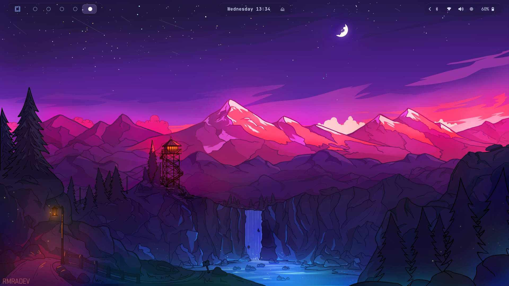

# 🚀 Aashutosh's Dotfiles

My personal Arch Linux + Omarchy + Hyprland setup.

# Screenshot



## ✨ Features

- 🖥️ Hyprland + Omarchy
- 🎨 Tokyo Night theme
- ⚡ Fastfetch
- ⭐ Starship prompt
- 📝 Neovim (LazyVim)
- 📂 Yazi
- 🐚 Zsh
- 👻 Ghostty
- 📊 Btop
- 🎵 Wiremix
- 🔊 SwayOSD
- 🚀 Waybar
- 🖼️ Wallpapers collection

---

# 📦 Included Configurations

- Alacritty
- Atuin
- Btop
- Fastfetch
- Ghostty
- Hyprland
- Kitty
- Lazydocker
- Lazygit
- Mise
- MPV
- Neovim
- Starship
- SwayOSD
- Tmux
- Voxtype
- Walker
- Waybar
- Wiremix
- Yazi
- Zellij
- Zsh

---

# 📥 Installation

Clone:

```bash
git clone https://github.com/<your-username>/dotfiles.git
cd dotfiles
```

Run:

```bash
chmod +x install.sh
./install.sh
```

---

# 💾 Backup

```bash
./scripts/backup.sh
```

---

# ♻️ Restore

```bash
./scripts/restore.sh
```

---

# 📂 Repository Structure

```text
.
├── alacritty/
├── atuin/
├── btop/
├── fastfetch/
├── ghostty/
├── home/
├── hypr/
├── kitty/
├── lazydocker/
├── lazygit/
├── mise/
├── mpv/
├── nvim/
├── omarchy/
├── packages/
├── scripts/
├── starship/
├── swayosd/
├── tmux/
├── voxtype/
├── walker/
├── wallpapers/
├── waybar/
├── wiremix/
├── yazi/
└── zellij/
```

---

# 🛠 Requirements

- Arch Linux
- Omarchy
- yay
- Git

---

# 📜 License

MIT License