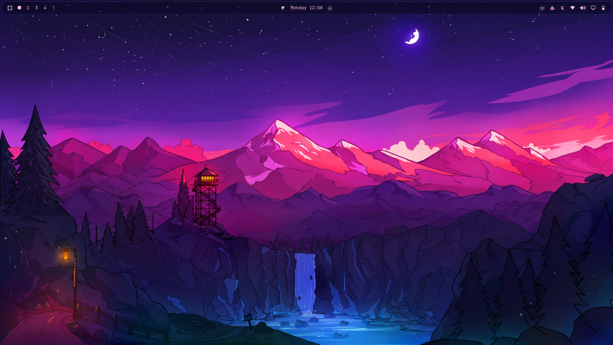
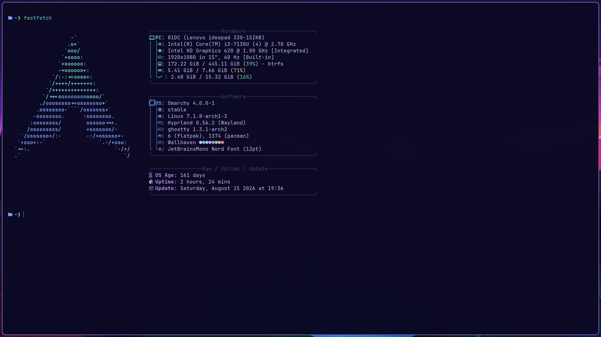
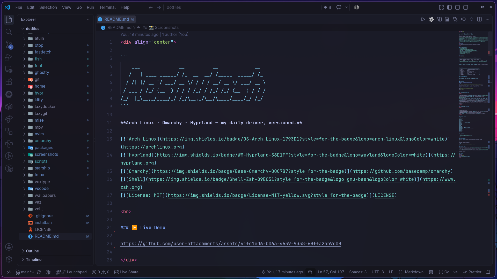
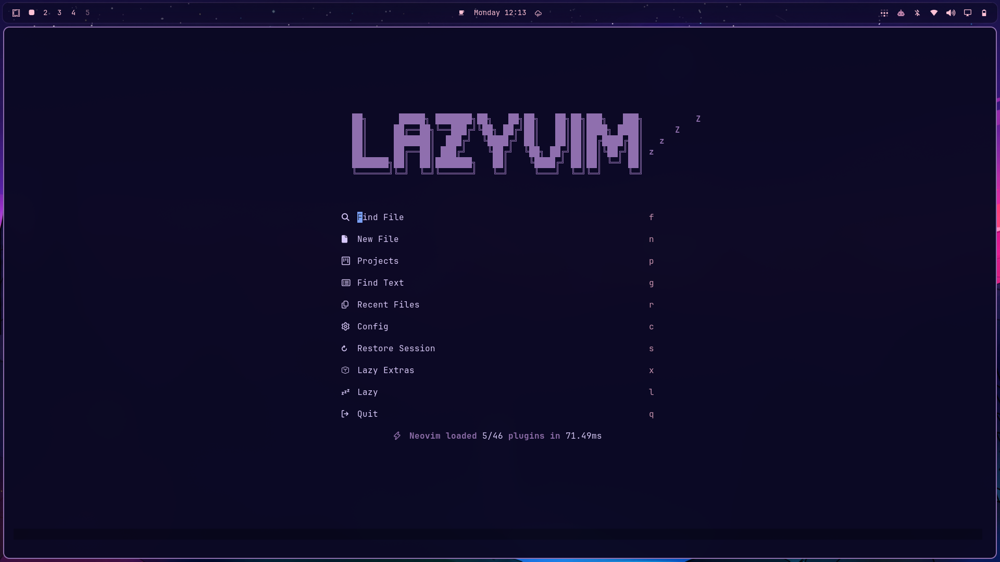
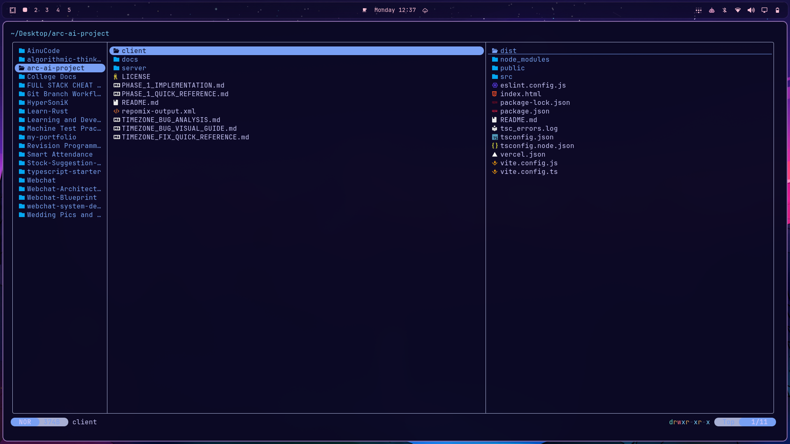
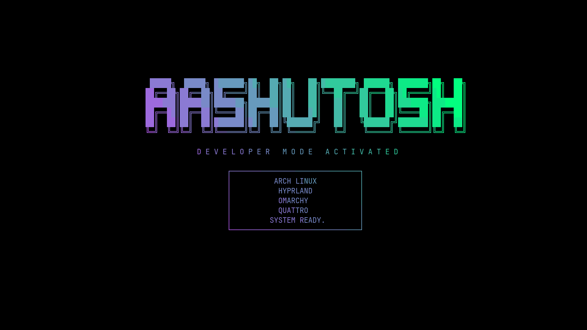

<div align="center">

```
 █████╗  █████╗ ███████╗██╗  ██╗██╗   ██╗████████╗ ██████╗ ███████╗██╗  ██╗
██╔══██╗██╔══██╗██╔════╝██║  ██║██║   ██║╚══██╔══╝██╔═══██╗██╔════╝██║  ██║
███████║███████║███████╗███████║██║   ██║   ██║   ██║   ██║███████╗███████║
██╔══██║██╔══██║╚════██║██╔══██║██║   ██║   ██║   ██║   ██║╚════██║██╔══██║
██║  ██║██║  ██║███████║██║  ██║╚██████╔╝   ██║   ╚██████╔╝███████║██║  ██║
╚═╝  ╚═╝╚═╝  ╚═╝╚══════╝╚═╝  ╚═╝ ╚═════╝    ╚═╝    ╚═════╝ ╚══════╝╚═╝  ╚═╝
```

**Arch Linux · Omarchy · Hyprland — my daily driver, versioned.**

[](https://archlinux.org)
[](https://hyprland.org)
[](https://github.com/basecamp/omarchy)
[](https://www.zsh.org)
[](LICENSE)

<br>

### ▶️ Live Demo

[Demo Video](https://youtu.be/pNU84d3qIt0)

</div>

---

## `$ cat table_of_contents.txt`

- [Screenshots](#-screenshots)
- [Features](#-features)
- [Included Configurations](#-included-configurations)
- [Installation](#-installation)
- [Updating an Existing Installation](#-updating-an-existing-installation)
- [🩺 Diagnose & Repair](#-diagnose--repair)
- [Zsh Is Required](#%EF%B8%8F-zsh-is-required)
- [About `~/.local/bin/env`](#about-localbinenv)
- [What `install.sh` Actually Does](#-what-installsh-actually-does)
- [What `bootstrap.sh` Actually Does](#-what-bootstrapsh-actually-does)
- [Repository Structure](#-repository-structure)
- [Requirements](#-requirements)
- [Backups & Rollback](#-backups--rollback)
- [Wallpaper Credits](#️-wallpaper-credits)
- [License](#-license)

---

## 📸 Screenshots

<div align="center">

<a href="screenshots/">
  
</a>
<p><em>Hero shot: Hyprland + Omarchy shell + wallhaven</em></p>

<table>
  <tr>
    <td width="50%">
      <a href="screenshots/">
        
      </a>
    </td>
    <td width="50%">
      <a href="screenshots/">
        
      </a>
    </td>
  </tr>
  <tr>
    <td><em>Ghostty + Fastfetch + Starship</em></td>
    <td><em>Editor workflow in VS Code</em></td>
  </tr>
</table>

<table>
  <tr>
    <td width="33%">
      <a href="screenshots/">
        
      </a>
    </td>
    <td width="33%">
      <a href="screenshots/">
        
      </a>
    </td>
    <td width="33%">
      <a href="screenshots/">
        
      </a>
    </td>
  </tr>
  <tr>
    <td><em>LazyVim</em></td>
    <td><em>Yazi file manager</em></td>
    <td><em>Idle screensaver</em></td>
  </tr>
</table>

</div>

## ✨ Features

|                             |                                              |
| --------------------------- | -------------------------------------------- |
| 🖥️ **WM**                   | Hyprland on Omarchy (Quickshell-based shell) |
| 🎨 **Theme**                | wallhaven, applied system-wide via Aether    |
| ⚡ **System Info**          | Fastfetch                                    |
| ⭐ **Prompt**               | Starship                                     |
| 📝 **Editors**              | Neovim (LazyVim) & VS Code                   |
| 📂 **File Manager**         | Yazi                                         |
| 🐚 **Shell**                | Zsh (fish in foot)                           |
| 👻 **Terminal**             | Ghostty / Alacritty / Kitty / Foot           |
| 📊 **Monitor**              | Btop                                         |
| 🚀 **Bar / Launcher / OSD** | Omarchy shell (Quickshell)                   |
| 🖼️ **Wallpapers**           | Curated collection included                  |

---

## 📦 Included Configurations

```
alacritty · atuin · btop · fastfetch · fish · foot · ghostty · hyprland
kitty · lazydocker · lazygit · mise · mpv · neovim · omarchy · starship
tmux · voxtype · VS Code · yazi · zellij · zsh
```

---

## 📥 Installation

### Option A — One-shot bootstrap (fresh machine)

```bash
curl -fsSL https://raw.githubusercontent.com/Aashutosh31/dotfiles/main/bootstrap.sh | bash
```

Handles everything: installs `git`/`yay` if missing, clones the repo, and runs the installer.

### Option B — Manual (already have the repo cloned, or want to review first)

```bash
git clone https://github.com/Aashutosh31/dotfiles.git
cd dotfiles
chmod +x install.sh
./install.sh
```

After installation, if Hyprland is running, reload the config to apply changes:

```bash
hyprctl reload
```

Then **open a new terminal** — the installer makes sure zsh is your login shell, and a shell change only applies to new login sessions.

---

## 🔁 Updating an Existing Installation

`install.sh` is safe to re-run at any time — that *is* the update mechanism:

```bash
cd ~/dotfiles
git pull
./install.sh
```

- Every file it overwrites is backed up first to `~/.dotfiles-backup/<timestamp>/`.
- It never deletes your config directories and never removes files that only exist on your system.
- It does **not** perform a system upgrade (no `pacman -Syu`) — on Omarchy, upgrades belong to `omarchy update`, which the installer never bypasses. It only installs packages from `packages/` that are missing.
- If something in your shell environment is still off afterwards, see [Diagnose & Repair](#-diagnose--repair) below.

---

## 🩺 Diagnose & Repair

Two companion scripts let you fix problems without reinstalling everything.

### `doctor.sh` — read-only health check

```bash
./doctor.sh
```

Checks, without touching anything:

| Check                                             | Severity |
| ------------------------------------------------- | -------- |
| Required packages installed (`zsh`, `starship`, `zoxide`, `atuin`, `yazi`, `mise`, plugins, …) | FAIL if missing |
| Commands resolvable on `$PATH`                     | FAIL if missing |
| `/bin/zsh` + `/usr/bin/zsh` exist, zsh listed in `/etc/shells` | FAIL if missing |
| Login shell is zsh                                 | FAIL otherwise |
| `~/.local/bin/env` + `env.fish` present            | FAIL if missing |
| zsh-autosuggestions / zsh-syntax-highlighting plugin files | FAIL if missing |
| Installed shell configs match the repo             | WARN on drift |
| Broken symlinks under `~/.config`                  | WARN |

Exit code is non-zero when any required component is missing, so you can use it in scripts or CI.

### `repair.sh` — fix an existing installation

```bash
./repair.sh
```

Safe and idempotent — run it as many times as you like; unchanged state prints `[SKIP]`. It:

1. Installs **only** required packages that are actually missing.
2. Ensures zsh is installed and listed in `/etc/shells`.
3. Sets your login shell to zsh — **only if it isn't already** (never repeats `chsh`), printing a clear message and reminding you to start a new session.
4. Recreates `~/.local/bin/env` / `env.fish` when they are missing (see below).
5. Re-applies only the shell-related configs (`.zshrc`, `.XCompose`, starship, fish, mise, atuin) — each backed up before being overwritten.

It never runs a system upgrade, never deletes home/config data, and exits non-zero if anything could not be fixed.

---

## 🐚 Zsh Is Required

This setup **requires Zsh**. The shell environment depends on zsh-specific features:

- zsh options & completion (`setopt`, `autoload -Uz compinit`)
- zoxide integration (`z`, `cd=z`)
- atuin history integration (`eval "$(atuin init zsh)"`)
- zsh-autosuggestions & zsh-syntax-highlighting
- Starship prompt
- all existing aliases/functions in [.zshrc](home/.zshrc)

`install.sh` and `repair.sh` both ensure: zsh installed → `/bin/zsh` present and listed in `/etc/shells` → login shell set to `/bin/zsh` (only when needed). After the change you must **start a new login session/terminal** for it to take effect. Don't try to `source ~/.zshrc` from Bash — it uses zsh-only builtins and will error.

---

## About `~/.local/bin/env`

The last line of `.zshrc` sources `~/.local/share/../bin/env` (= `~/.local/bin/env`). That file is created by **uv's standalone installer** (`curl -LsSf https://astral.sh/uv/install.sh | sh`), not by mise, Omarchy, pacman, or this repo. On a fresh machine where uv was never installed standalone, the file doesn't exist and every zsh startup ends with:

```
/home/<you>/.local/share/../bin/env: No such file or directory
```

`install.sh` and `repair.sh` recreate this file — byte-for-byte identical to uv's template — whenever it is missing, so the shell always starts cleanly even before uv itself is installed.

---

## 🔍 What `install.sh` Actually Does

<details>
<summary><strong>Click to expand the step-by-step breakdown</strong></summary>

1. **Resolves the repo path** — works regardless of where you run it from (`$REPO` = script's own directory).
2. **Installs missing official packages** — ensures everything in [`packages/pacman.txt`](packages/pacman.txt) is present, using Omarchy's `omarchy-pkg-add` helper when available (falling back to `pacman -S --needed`). This **does not perform a full system upgrade** — on Omarchy, system upgrades belong to `omarchy update`, which the installer never bypasses.
3. **Installs AUR packages** — if `yay` is present, installs everything in [`packages/aur.txt`](packages/aur.txt) non-interactively (`--answerclean None --answerdiff None`). Skips gracefully if `yay` isn't found.
4. **Creates a timestamped backup** at `~/.dotfiles-backup/<YYYY><MM><DD>-<HHMMSS>/` — see [Backups & Rollback](#-backups--rollback) below.
5. **Backs up and replaces each config** — for every tool in the list (`alacritty`, `atuin`, `btop`, `fastfetch`, `fish`, `foot`, `ghostty`, `hypr`, `kitty`, `lazydocker`, `lazygit`, `mise`, `mpv`, `nvim`, `omarchy`, `tmux`, `voxtype`, `yazi`, `zellij`):
   - if a matching config exists in this repo, each file in your current `~/.config/<tool>` is backed up individually, then replaced in-place (safe to run while a desktop session is live — the directory is never deleted).
6. **Installs starship** at `~/.config/starship.toml`, the **wallhaven theme background** into `~/.config/omarchy/themes/wallhaven/`, and the custom **About screen launcher** to `~/.local/bin/omarchy-launch-about`.
7. **Backs up and replaces dotfiles** — `~/.zshrc` and `~/.XCompose` get the same backup-then-overwrite treatment.
8. **Sets up the shell environment (Stage 4)** — makes sure copying `.zshrc` actually results in a *usable* shell:
   - adds zsh to `/etc/shells` if missing,
   - sets your login shell to zsh **only if it isn't already** (never re-runs `chsh` unnecessarily; prints a clear message when it changes and reminds you that a new login session is needed),
   - recreates `~/.local/bin/env` + `env.fish` if they're missing (uv-installer template — see [About `~/.local/bin/env`](#about-localbinenv)),
   - verifies every command `.zshrc` depends on resolves, warning about any that don't.
9. **Prints the backup location** so you always know exactly where your previous setup went.

**Nothing is deleted without a backup first.** Every overwrite is preceded by a copy (`cp -a`) into the timestamped backup folder. Configs are installed via per-file in-place replacement so a running desktop session never sees a missing or partially-written config directory.

</details>

---

## 🥾 What `bootstrap.sh` Actually Does

<details>
<summary><strong>Click to expand</strong></summary>

Bootstrap is for a **brand-new machine** that doesn't have this repo (or possibly `git`/`yay`) yet:

1. **Verifies you're on Arch** — checks for `pacman`, exits cleanly otherwise (no Arch, no dice).
2. **Installs Git** if missing.
3. **Installs `yay`** if missing — clones and builds it from the AUR via `makepkg -si`.
4. **Clones or updates the repo** — clones fresh to `~/dotfiles` if it doesn't exist, or `git pull`s if it does.
5. **Makes scripts executable** — `install.sh` and everything in `scripts/`.
6. **Hands off to `install.sh`** to do the actual config installation described above.

In short: `bootstrap.sh` gets a bare Arch install to the point where `install.sh` can run — then runs it.

</details>

---

## 📂 Repository Structure

```text
.
├── alacritty/
├── atuin/
├── btop/
├── doctor.sh       # read-only installation health check
├── fastfetch/
├── fish/
├── foot/
├── ghostty/
├── home/          # ~/.zshrc, ~/.XCompose
├── hypr/          # Hyprland Lua config (Quattro)
├── kitty/
├── lazydocker/
├── lazygit/
├── mise/
├── mpv/
├── nvim/
├── repair.sh      # safe, idempotent in-place repair
├── vscode/
├── omarchy/       # shell, bar plugin, theme, hooks, theme.name
├── bootstrap.sh   # one-shot installer for fresh machines
├── packages/       # pacman.txt, aur.txt
├── scripts/       # omarchy-launch-about, lib/shell-env.sh
├── starship/
├── tmux/
├── voxtype/
├── wallpapers/
├── yazi/
└── zellij/
```

---

## 🛠 Requirements

- Arch Linux
- [Omarchy](https://github.com/basecamp/omarchy)
- **Zsh** (installed and set as login shell automatically by `install.sh` / `repair.sh` — required for this setup to function)
- `yay` (auto-installed by `bootstrap.sh` if missing)
- Git

---

## 🔄 Backups & Rollback

Every run of `install.sh` creates a fresh timestamped snapshot before touching anything:

```
~/.dotfiles-backup/20260701-143022/
```

To roll back a specific config manually:

```bash
cp -a ~/.dotfiles-backup/<timestamp>/.config/<tool> ~/.config/
```

## 📜 License

MIT License

<div align="center">

`built in the terminal, for the terminal`

</div>
